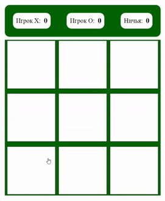
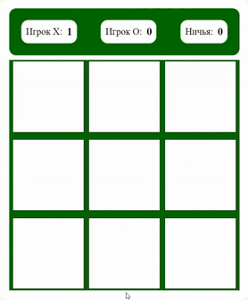

# Tic-tac-toe

Tic Tac Toe is a classic two-player strategy game that is played on a 3x3 grid. The objective of the game is to be the first player to place three of their symbols (either 'X' or 'O') in a horizontal, vertical, or diagonal line. Players take turns placing their symbols on an empty space within the grid, with the first player typically using 'X' and the second player using 'O'." If no player succedes and all spaces on the grid are filled, the game is considered a draw.

## Features

- **ADAPTIVE GAME INTERFACE**

  The project provides a clean and simple user interface, allowing players to easily start the game, track the score and quickly restart the game after the end of the game.

- **THE LOGIC OF DETERMINING THE WINNER & COUNTING AND DISPLATING THE SCORE**

  The game automatically determines the winner based on predefined winning combinations, highlighting the winning line and announcing the winner.

  The project includes a system for calculating wins for each player and draws, which adds an element of competition and allows players to track their progress over time.

  ```
  function handleWin(winner) {
  setTimeout(function () {
    alert(`Победил игрок ${winner}`);
    bottom.classList.remove("hidden");
  }, 500);
  if (winner == "X") {
    scoreX.innerHTML = +scoreX.innerHTML + 1;
  } else {
    scoreO.innerHTML = +scoreO.innerHTML + 1;
  }
  ```

- **THE FUNCTIONALITY OF RESTARTING THE GAME**

  With the restart button, players can easily start a new game without having to refresh the page, saving the current score to continue the competition.

  ```
  function handleRestart() {
  currentPlayer = "X";
  gameIsOver = false;
  fields.forEach(function (item) {
  item.innerHTML = "";
  item.classList.remove("win");
  });
  bottom.classList.add("hidden");
  }
  ```

## Technologies

- **HTML & CSS**: For structuring and styling the game's user interface.

- **JavaScript**: The primary programming language used for creating the game logic and user interactions.

- **DOM Manipulation**: Using the Document Object Model (DOM) to dynamically change the content and structure of the web page in response to user actions.

- **Event Listeners**: Implementing event handlers to respond to clicks on the game board and the restart button.

- **Conditional Logic**: Utilizing conditional operators to check game states, determine the winner, or identify a draw.

- **Looping**: Using loops to iterate over arrays and DOM elements.
- **Array Manipulation**: Working with arrays to store the positions of winning combinations.

## GIFs




